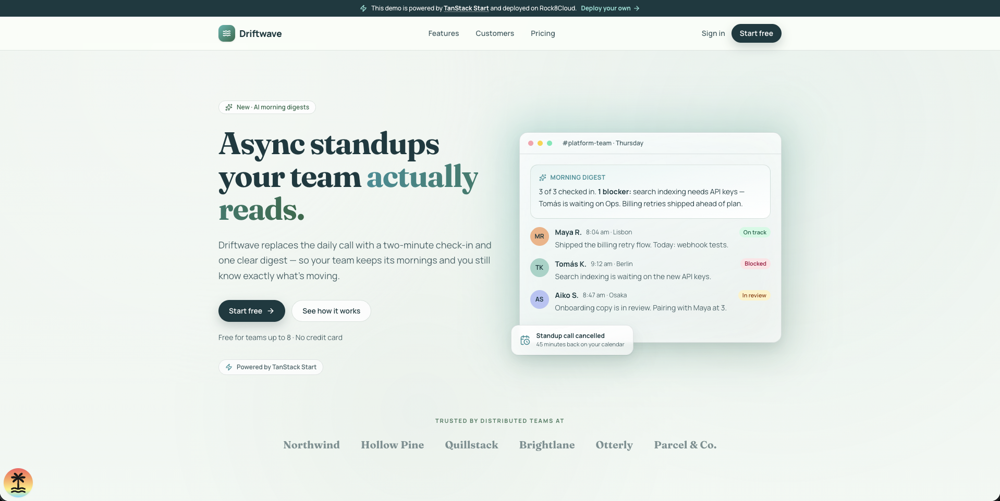

# TanStack Start Blueprint

A production-ready starter for full-stack React apps on
[TanStack Start](https://tanstack.com/start), built to deploy on
[Rock8Cloud](https://rock8.cloud) in one push. Server-side rendering, file-based
routing, server functions, TanStack Query, Tailwind v4 and shadcn/ui are wired
up; the build is a single self-contained Node server in a checked-in
Dockerfile.

[](https://app.rock8.cloud/login?redirect=%2Fnew-deployment%3Fblueprint%3Dtanstack-start)

The landing page at `/` is for **Driftwave**, a fictional product — it exists
to show what the stack looks like out of the box. Replace it with your own.

| Layer   | Tech                                                                                                                                         |
| ------- | -------------------------------------------------------------------------------------------------------------------------------------------- |
| App     | [TanStack Start](https://tanstack.com/start) + [TanStack Router](https://tanstack.com/router) on React 19                                    |
| Data    | [TanStack Query](https://tanstack.com/query), with SSR integration                                                                           |
| UI      | [Tailwind CSS v4](https://tailwindcss.com) + [shadcn/ui](https://ui.shadcn.com) + [lucide](https://lucide.dev) icons                         |
| Server  | [Nitro](https://nitro.build) — emits a self-contained Node server to `.output/`                                                              |
| Tooling | [Bun](https://bun.sh), [Vite](https://vite.dev), ESLint ([tanstack/eslint-config](https://tanstack.com/config/latest/docs/eslint)), Prettier |
| Deploy  | [Rock8Cloud](https://rock8.cloud) — one Dockerfile service                                                                                   |

## Quickstart

Prerequisites: [Bun](https://bun.sh) ≥ 1.3.

```sh
bun install
bun run dev        # http://localhost:3000
```

No environment variables are required to run the blueprint.

## Layout

```
src/
  routes/
    __root.tsx               HTML shell, <head> meta, devtools
    index.tsx                "/" — composes the landing sections
  components/
    landing/                 one file per landing-page section
    layout/                  header, footer, powered-by bar, logo
  content/landing.ts         all landing-page copy and data
  routeTree.gen.ts           generated by the router plugin (committed, do not edit)
  router.tsx                 router + TanStack Query SSR integration
  integrations/tanstack-query/
  lib/utils.ts               cn() class helper for shadcn
  styles.css                 Tailwind, theme tokens and custom utilities
Dockerfile                   how Rock8Cloud builds this service
.mcp.json                    Rock8Cloud MCP endpoint, for agent-driven deploys
AGENTS.md                    guidance for coding agents
```

## Commands

| Command             | What it does                                               |
| ------------------- | ---------------------------------------------------------- |
| `bun run dev`       | Dev server with HMR on `:3000`                             |
| `bun run build`     | Production build → `.output/`                              |
| `bun run start`     | Run the production build (`node .output/server/index.mjs`) |
| `bun run typecheck` | `tsc --noEmit`                                             |
| `bun run lint`      | ESLint                                                     |
| `bun run format`    | Prettier + ESLint autofix                                  |
| `bun run check`     | Prettier check                                             |

## Deploy on [Rock8Cloud](https://rock8.cloud)

### Connect MCP and prompt your agent

This repository ships [`.mcp.json`](.mcp.json) with the Rock8Cloud MCP endpoint
already configured, so an MCP-capable coding agent can do the whole deployment.
Open the repo in your agent (Claude Code, for example), complete the OAuth login
when prompted, and ask:

```text
Deploy this project to Rock8Cloud.
```

No API key, deployment CLI or GitHub Actions workflow is required.

### Or deploy via the UI

1. **Push this repository to GitHub** and create a project at
   [app.rock8.cloud](https://app.rock8.cloud).
2. **Add a service from the repository**: Dockerfile path `Dockerfile`, default
   build context (repository root), container port **3000**.
3. **Deploy.** The Dockerfile runs `bun install --frozen-lockfile` and
   `bun run build`, then starts `node .output/server/index.mjs` on `node:22-slim`.
4. Every push to `main` redeploys automatically.

`PORT` is injected by the platform — do not set it manually; the Nitro server
binds whatever it is given.

Verify the image locally before deploying:

```sh
docker build -t tanstack-start-blueprint .
docker run --rm -p 3000:3000 tanstack-start-blueprint
```

> The `EXPOSE`d port (3000) must match the port configured on the Rock8Cloud
> service, or health checks will fail.

## Extending the blueprint

### Add a route

Add a file under `src/routes/` — the router plugin regenerates
`src/routeTree.gen.ts` on the next `dev` or `build`. Link to it with `Link`:

```tsx
import { Link } from '@tanstack/react-router'

;<Link to="/about">About</Link>
```

Anything in `src/routes/__root.tsx` appears on every page. See the
[routing docs](https://tanstack.com/router/latest/docs/framework/react/guide/routing-concepts).

### Server functions

Code that must run on the server (secrets, database calls) goes in a server
function. It is callable from components and loaders, and never shipped to the
browser:

```tsx
import { createServerFn } from '@tanstack/react-start'

const getServerTime = createServerFn({ method: 'GET' }).handler(async () => {
  return new Date().toISOString()
})
```

### API routes

Use the `server` property of a route for HTTP endpoints:

```tsx
import { createFileRoute } from '@tanstack/react-router'
import { json } from '@tanstack/react-start'

export const Route = createFileRoute('/api/hello')({
  server: {
    handlers: {
      GET: () => json({ message: 'Hello, World!' }),
    },
  },
})
```

### Load data

Use a route `loader` to fetch before render, or TanStack Query for cached,
client-refetchable data — the query client is already in the router context:

```tsx
export const Route = createFileRoute('/people')({
  loader: async () => (await fetch('https://swapi.dev/api/people')).json(),
  component: () => {
    const data = Route.useLoaderData()
    return (
      <ul>
        {data.results.map((p) => (
          <li key={p.name}>{p.name}</li>
        ))}
      </ul>
    )
  },
})
```

See the [data loading docs](https://tanstack.com/router/latest/docs/framework/react/guide/data-loading).

### Add shadcn components

```sh
bunx --bun shadcn@latest add button
```

Components land in `src/components/ui/` and use the theme tokens in
`src/styles.css`.

### Environment variables

Read configuration at request time inside server functions or route handlers
(`process.env.MY_VAR`), not at module top level — the Docker image is built
without secrets, and Rock8Cloud provides the environment at runtime. Keep local
values in `.env` (gitignored).

## Learn more

- [TanStack Start documentation](https://tanstack.com/start)
- [Rock8Cloud](https://rock8.cloud) · [Rock8Cloud docs](https://docs.rock8.cloud)

## License

MIT — use it however you like.
